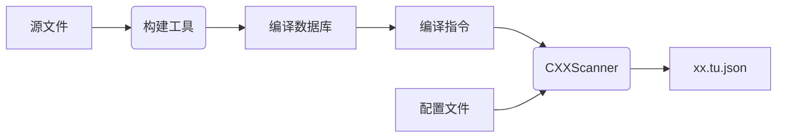

# tu-dumper

[](https://github.com/RichardLitt/standard-readme)

输入一条编译指令以及C++源文件，对编译指令对应的翻译转换单元的代码进行AST分析，并将分析结果输出为json分析模型

TODO: Fill out this long description.


## Table of Contents

- [Install](#install)
- [Usage](#usage)
- [API](#api)
- [Maintainers](#maintainers)
- [Contributing](#contributing)
- [License](#license)

## Install

### 安装cmake
略
### 安装vcpkg
[vcpkg](https://vcpkg.io/en/index.html)
```shell
# vcpkg integrate bash
# vcpkg integrate x-fish
vcpkg integrate zsh
```

### 安装ninja
```shell
brew install ninja
```

### 编译
```shell

./build.sh
ln -s /usr/local/lib/clang/  ./install/lib/clang
./install/bin/CXXScanner --output_dir ./result.json --compdb /Users/dongyilong/projects/Clion/TUDumper/build/debug/compile_commands.json --files all --verbose
```

## Usage

```shell
./install/bin/CXXScanner --output_dir ./result.json --compdb /Users/dongyilong/projects/Clion/TUDumper/build/debug/compile_commands.json --files all --verbose
```

https://github.com/sourcegraph/lsif-clang
If you get missing header warnings (possible due to divergence between lsif-clang and Apple Clang), use an extra flag:
--extra-arg="-resource-dir=$(clang -print-resource-dir)" compile_commands.json
## API

## Maintainers

[@yilongdong](https://github.com/yilongdong)

## Contributing

PRs accepted.

Small note: If editing the README, please conform to the [standard-readme](https://github.com/RichardLitt/standard-readme) specification.

## License

MIT © 2023 yilongdong
